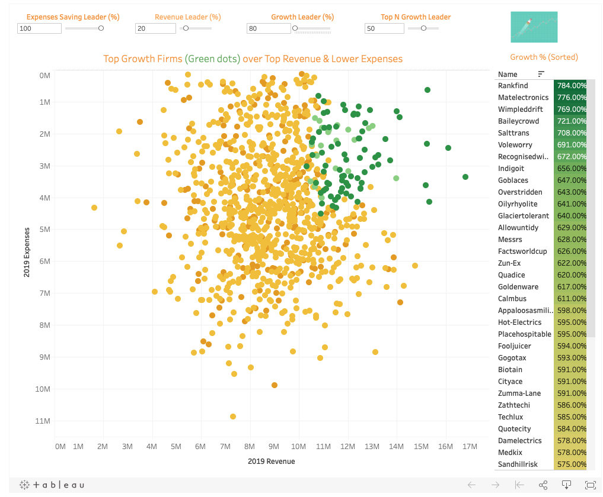
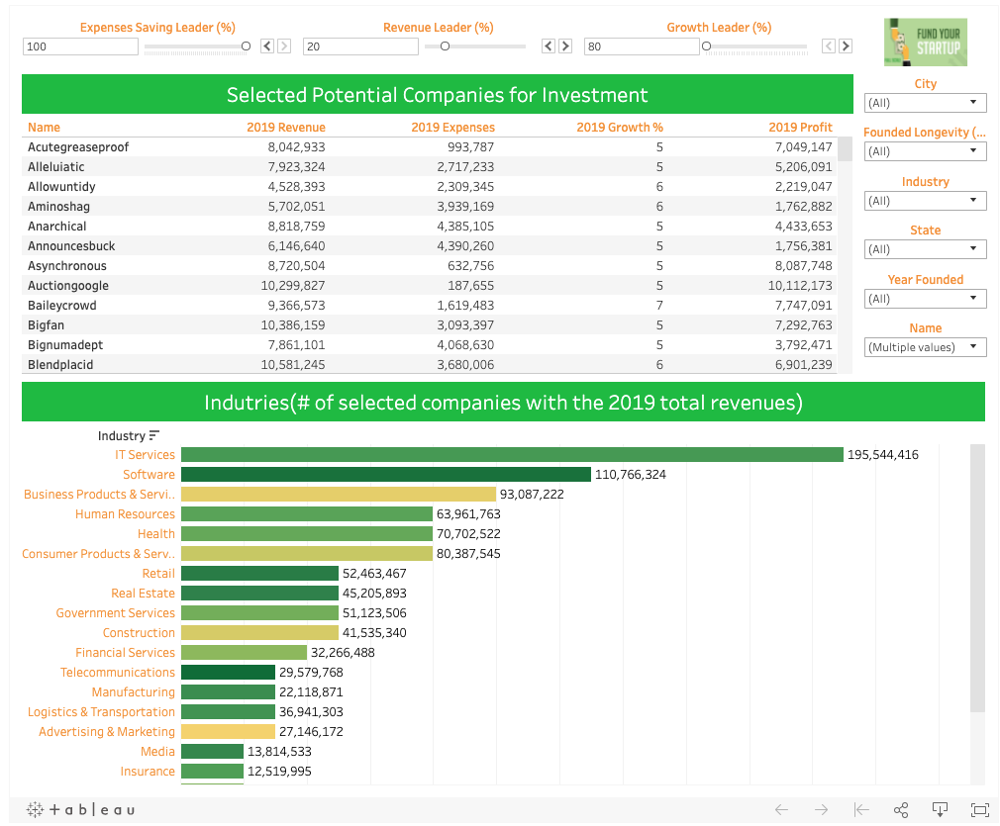
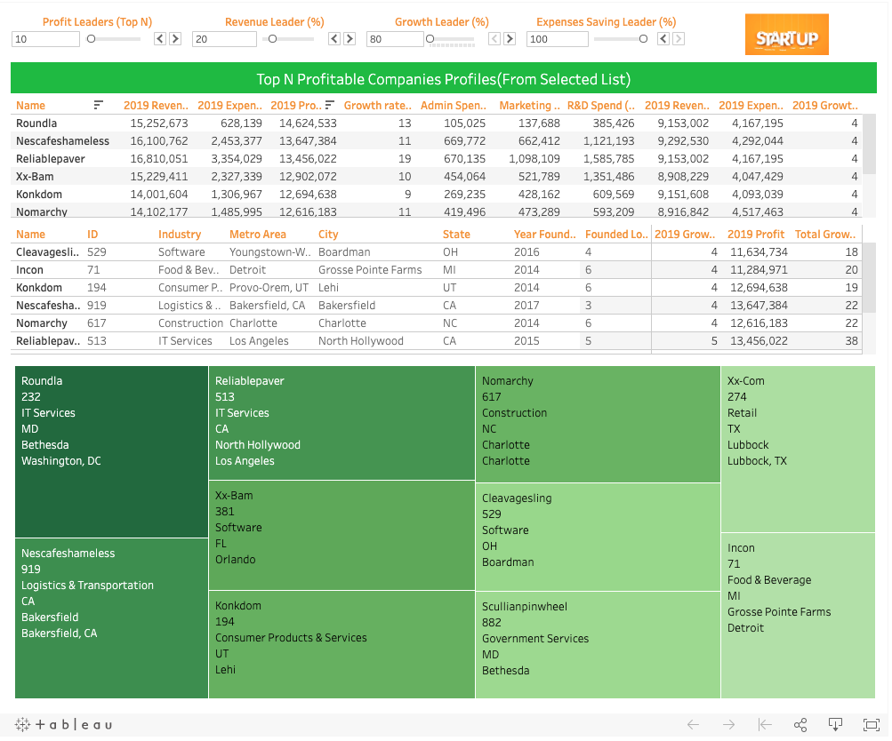

# Venture-Capital-1000-Start-up-Investment-Analysis

## Project Goal:

- Giving recommandations on current 1000 potentally interested startups and decide on whuch ones the venture capital to invest in
- Build a regression model to predict on the favorable startups to invest in the future

### Python Data and Features Engineering (Python Pandas)

- Clean and formatted data with python pandas
- Engineer additional numeric/categorical features for tableau analysis and statiscal modeling
- Group varaibles for calcualtions and exploratory analysis  

### Dashboard and Vizualization Analysis (Tableau)

Conditions: Created dynamic sets of top companies of next 3 criteria with powefl filter, parameters and visualizations
- High revenue (2019) E.G. Higher than X %  *  Industry Mean
- Low Expenses (2019) E.G. Threshold: lower than X %  * Industry Mean
- Top Profit (2019): E.G. Top N 
- Top Growth (2019): E.G. Higher than the X % * industry mean or Top N Growth

#### Growth Analysis Dashbaord

* growth data to display top growth firm
* scatter plot: deep green or greens are counted as top growing firm with the best performing revenue and expense

Dashboard Link: https://public.tableau.com/profile/xiaoyang.wu#!/vizhome/StartupTopGrowthAnalysis/TopGrowthAnalysis?publish=yes

#### Selected Potential Companies for Investment Dashboard

* Selected Companies Analysis
* Selected companies Industry analysis (bar chart)

Dashboard Link: https://public.tableau.com/profile/xiaoyang.wu#!/vizhome/SelectedStartupforVentureCapitalInvestingAnalysis/SelectedPotentialCompaniesforInvestment?publish=yes

#### Top Profitable Companies to Invest Dashboard

* Top N Most Profitable Companies (Portfolio Analysis)
* Top N Mots Profitable Companies (tree map)

Dashboard Link: https://public.tableau.com/profile/xiaoyang.wu#!/vizhome/TopNMostProfitableStartupforInvestingAnalysis/TopProfitableCompaniestoInvest?publish=yes

### Building a profit prediction model (Selected companies)

According to the potential selected companies to build a multple lieanr regression model:

* Y = "2109 Profit"
* X = '2019 Revenue', '2019 Growth %', 'Employees', 'Company Founded Longevity', 'Admin Spend (2019)', 'Marketing & Sales Spend (2019)',  'R&D Spend (2019)', 

*** equation ***
* Y (2019 Profit) = 1 * X1 (2019 Reveneu) + 0.0014147 * X2 (2019 Growth) - 2.55003695e-06 * X3 (Number of Employee) -2.83187758e-06 * X4(Company Founded Lengevity) -0.9999 * X5 (Admin Spend (2019)) -1 * X6(Marketing & Sales Spend (2019)) -1 * X7 (R&D Spend (2019)) -0.013577 

### Building a Investment Decision Model (based on selected companies)

According to the potential selected companies to build a classification model to help invester to make investment decisions:

* Y = 1 or 0 (1 as selected starups as consideration of investment, 0 as non-selected starups)
* X = 'Employees', 'Company Founded Longevity', 'Total Growth in 3 years' ,'Avg Profit (2017-2019)',   'Avg Expenses (2017-2019)', 'Avg Revenue (2017-2019)'

##### Logistic Regression Model
* the Logsitic Sigmoid Function: Log_Odd(P) = -6.29423268 + 0.191379(#ofEmployees)X_1 -0.11357923(CompanyFoundedLongevity)X_2 + -0.11357923('Total Growth')X_2 + -0.11357923(Avg Profit (2017-2019))X_2 + -0.11357923(Avg Expenses (2017-2019))X_2 + -0.11357923(Avg Revenue (2017-2019))X_2 

Model Accuracy Rate: 0.9239
Logistic Regression Cross validation Accuracy: 94.7212 %
Standerd Deviation: 2.20 %

##### Support Vector Machine Model

Model Accuracy Rate: 0.9457
SVM Model Cross-Validating Accuracy: 96.5865 %
Standerd Deviation: 1.52 %

##### K-NN Model

Model Accuracy Rate: 0.942
KNN Model Cross-Validating Accuracy: 95.9663 %
Standerd Deviation: 2.11 %

##### Naive Bayes Model

Model Accuracy Rate: 0.9239
Naive Bayes Model Cross-Validating Accuracy: 94.5529 %
Standerd Deviation: 2.72 %

------------------ Conclusion: ----------------------

## Support Vector Machine Model is winning so far!!!!