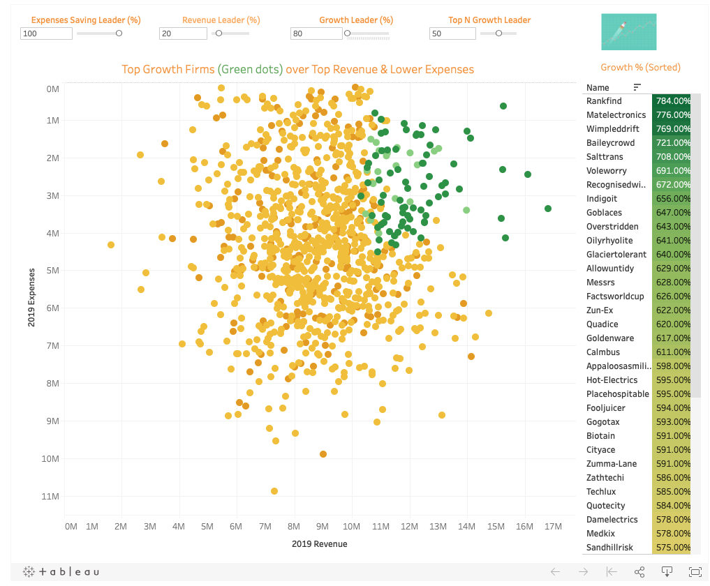
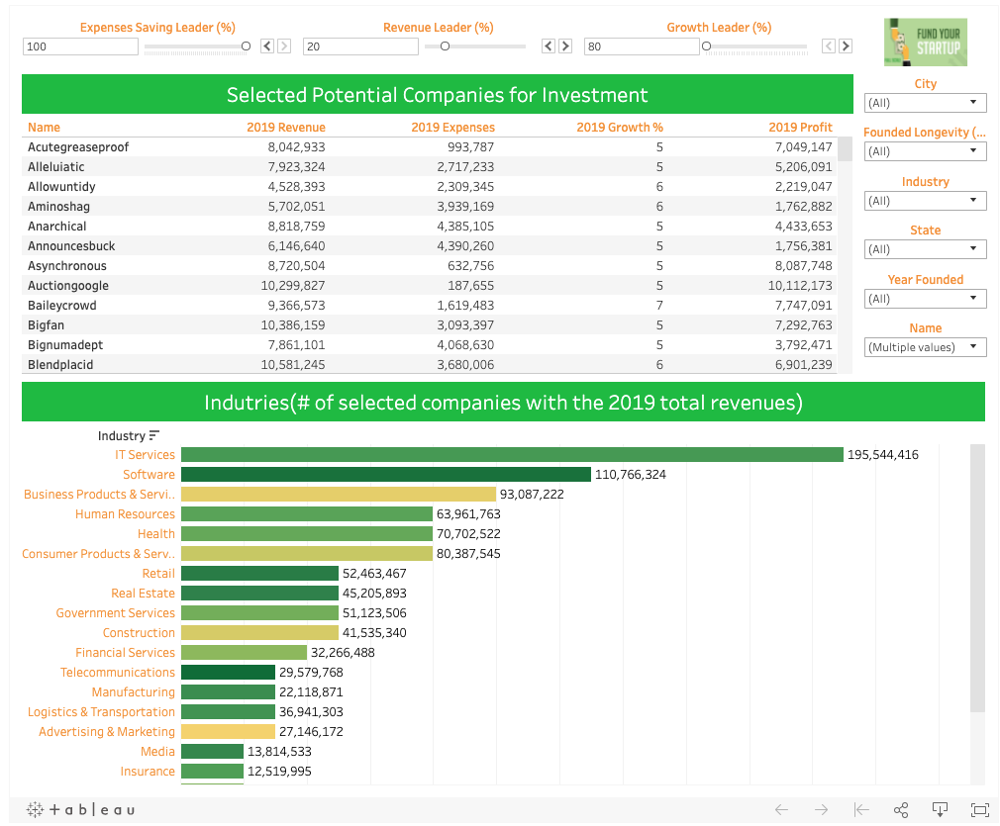

# Venture-Capital-1000-Start-up-Investment-Analysis

## Project Goal:

- Giving recommandations on current 1000 potentally interested startups and decide on whuch ones the venture capital to invest in
- Build a regression model to predict on the favorable startups to invest in the future

### Python Data and Features Engineering (Python Pandas)

- Clean and formatted data with python pandas
- Engineer additional numeric/categorical features for tableau analysis and statiscal modeling
- Group varaibles for calcualtions and exploratory analysis  

### Dashboard and Vizualization Analysis (Tableau)

Conditions: Created dynamic sets of top companies of next 3 criteria with powefl filter, parameters and visualizations
- High revenue (2019) E.G. Higher than X %  *  Industry Mean
- Low Expenses (2019) E.G. Threshold: lower than X %  * Industry Mean
- Top Profit (2019): E.G. Top N 
- Top Growth (2019): E.G. Higher than the X % * industry mean or Top N Growth

#### Growth Analysis Dashbaord

* growth data to display top growth firm
* scatter plot: deep green or greens are counted as top growing firm with the best performing revenue and expense

Dashboard Link: https://public.tableau.com/profile/xiaoyang.wu#!/vizhome/StartupTopGrowthAnalysis/TopGrowthAnalysis?publish=yes

#### Selected Potential Companies for Investment Dashboard

* Selected Companies Analysis
* Selected companies Industry analysis (bar chart)

Dashboard Link: https://public.tableau.com/profile/xiaoyang.wu#!/vizhome/SelectedStartupforVentureCapitalInvestingAnalysis/SelectedPotentialCompaniesforInvestment?publish=yes

#### Top Profitable Companies to Invest Dashboard

* Top N Most Profitable Companies (Portfolio Analysis)
* Top N Mots Profitable Companies (tree map)

Dashboard Link: https://public.tableau.com/profile/xiaoyang.wu#!/vizhome/TopNMostProfitableStartupforInvestingAnalysis/TopProfitableCompaniestoInvest?publish=yes

